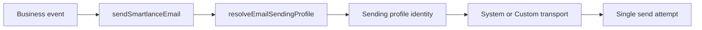

# Email architecture

Smartlance uses a centralized server-side email entry point with optional
**sending profiles** and **category routing** (V1).

## Entry points

```ts
// Preferred — categorized routing
sendSmartlanceEmail({ category, to, subject, text, html?, ... })

// Legacy wrapper — category GENERAL_SYSTEM
sendTransactionalEmail({ to, subject, text, html?, replyTo? })
```

Locations:

- `lib/email/send-smartlance.ts` — `sendSmartlanceEmail`
- `lib/email/send.ts` — `sendTransactionalEmail`

Form notifications (`lib/forms.ts`), CRM, billing, proposals, and other
features call these functions — not Nodemailer or Resend directly.

See [`EMAIL_SENDING_PROFILES.md`](./EMAIL_SENDING_PROFILES.md) for profiles,
routing, RBAC, and CRM snapshots.

## Flow (V1)



When no profiles exist in the database, resolution falls back to the legacy
system sender (same behavior as pre-V1).

## Previous delivery system

Before Admin SMTP:

- **Resend HTTP API** via `RESEND_API_KEY` and `fetch("https://api.resend.com/emails")`
- Optional **webhooks** (`FORM_WEBHOOK_URL`, type-specific overrides)
- Notification recipients from Site Settings extras / env (`CONTACT_TO_EMAIL`)
- Plain-text templates inline in `lib/forms.ts`

Project Planner does not send email.

## Active transport resolution

Precedence (`lib/email/config.ts`):

1. **Admin SMTP enabled** with valid host, port, and from email → Nodemailer SMTP
2. **Environment SMTP** (`SMTP_HOST`, `SMTP_PORT`, `SMTP_FROM_EMAIL`, …) when Admin SMTP is disabled
3. **Resend** when `RESEND_API_KEY` is set and Admin/env SMTP is not active
4. **None** — webhooks may still deliver; otherwise notification fails safely

Important: when Admin SMTP is **enabled**, the system does **not** silently fall
back to Resend on SMTP failure. Failures are reported accurately.

When Admin SMTP is **disabled**, stored credentials remain in the database but
are not used.

Sending profiles with `SYSTEM_SMTP` reuse this connection; profiles with
`CUSTOM_SMTP` use profile-specific credentials. There is no automatic fallback
to another profile on send failure.

## Enquiry persistence semantics

Unchanged:

1. Validate submission
2. Persist `Enquiry` to Postgres (`notificationStatus: NOT_ATTEMPTED`)
3. Attempt notification (webhook ± email)
4. Update `notificationStatus` to `SENT` or `FAILED`
5. Return public success if the DB write succeeded

SMTP failure never rolls back a saved enquiry.

## Reply-To handling

Enquiry notifications use:

- **From:** configured Smartlance sender (`fromEmail` / `fromName`) or routed profile
- **Reply-To:** validated visitor email

Visitor addresses are never spoofed into the SMTP `From` header.

CRM categories use profile `replyToEmail` when set, else inbound mailbox
`crmReplyToEmail` where configured.

## Public settings

SMTP configuration is Admin/server-only. `getPublicSettings()` and public DTOs
do not expose host, username, password status, or encrypted secrets.

## Modules

| Path | Role |
|------|------|
| `lib/email/send-smartlance.ts` | `sendSmartlanceEmail` — canonical V1 entry |
| `lib/email/send.ts` | `sendTransactionalEmail` wrapper |
| `lib/email/config.ts` | System transport + recipient resolution |
| `lib/email/routing/resolve-profile.ts` | Profile resolution + fallback chain |
| `lib/email/routing/categories.ts` | Route category labels |
| `lib/email/transport/cache.ts` | Nodemailer transport cache |
| `lib/email/smtp.ts` | Nodemailer transport, verify, send |
| `lib/email/templates.ts` | Plain-text enquiry + test templates |
| `lib/email/errors.ts` | Safe error normalization |
| `lib/repositories/emailSettingsRepository.ts` | Global SMTP DB access + Admin DTO |
| `lib/repositories/emailSendingProfileRepository.ts` | Profile CRUD + encryption |
| `lib/repositories/emailRoutingRepository.ts` | Category routing |
| `lib/admin/email-settings-actions.ts` | Global SMTP save, test, audit |
| `lib/admin/email-profile-actions.ts` | Profile CRUD, routing, tests |

See also: [SMTP Admin configuration](./SMTP_ADMIN_CONFIGURATION.md)
