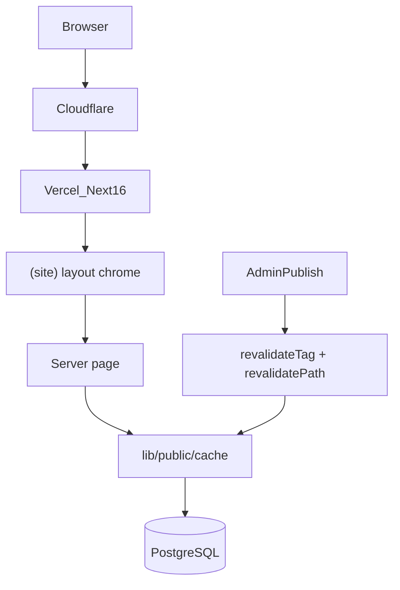

# Performance Architecture — Smartlance V1

## Request flow



## Route classification

| Class | Description | Examples |
|-------|-------------|----------|
| **STATIC** | Typed/code content, no CMS DB | `/how-we-work`, `/ai-automation/*` |
| **PUBLIC_CACHED** | Published CMS content, `unstable_cache` + tag invalidation | `/`, `/services/*`, `/work/[slug]`, `/blog/[slug]` |
| **PUBLIC_DYNAMIC** | Public but request-varying | `/work?capability=*`, `/blog?category=*` |
| **AUTH_DYNAMIC** | Session-scoped, `no-store` | `/admin/*`, `/portal/*`, `/workspace/*` |
| **REALTIME** | Mutations, tokens, webhooks | `/api/webhooks/*`, `/t/*`, payment callbacks |

## Layer responsibilities

| Layer | Role |
|-------|------|
| **Next.js 16.3** | App Router, RSC, `unstable_cache`, `React.cache`, `generateStaticParams` |
| **`lib/public/cache/`** | Cross-request cache (`unstable_cache`) + per-request dedup (`React.cache`) |
| **Repositories** | Prisma reads/writes; preview loaders stay uncached |
| **`lib/admin/publishing.ts`** | Tag taxonomy + invalidation on publish |
| **Vercel** | Framework-aware CDN for static assets and ISR/full-route cache where applicable |
| **Cloudflare** | DNS/proxy; static asset caching; **no sitewide HTML cache** (recommended) |
| **Browser** | Long cache for hashed `/_next/static/*` |

## Layout structure (post-refactor)

```
app/
  layout.tsx              # Root: fonts, globals, metadata only
  (site)/layout.tsx       # Public chrome + analytics
  (site)/page.tsx         # Homepage
  (site)/services/...     # Marketing routes
  admin/                  # No public chrome
  portal/
  workspace/
```

## Privacy rules

- Never cache: sessions, permissions, CRM, billing, proposals, support threads, preview tokens
- Preview routes use `getXForPreview` loaders — separate from published cache keys
- Authenticated trees: `Cache-Control: no-store` via `proxy.ts` + `next.config.ts`

## Cache Components status

- `cacheComponents: false` in `next.config.ts`
- No `"use cache"` directives
- Migration evaluated: **deferred** — existing `unstable_cache` + tags sufficient for V1

## Performance budgets (from baseline)

| Category | Baseline (local warm) | Target direction |
|----------|----------------------|----------------|
| Homepage TTFB | ~2070 ms | ↓ on Vercel CDN + warm cache |
| Public hub TTFB | ~700–1100 ms | ↓ with edge cache |
| Static JS (`.next/static`) | ~2.6 MB | Monitor; no admin leak |
| HTML size (homepage) | ~220 KB | Stable |

## Related docs

- [`CACHE_ARCHITECTURE.md`](CACHE_ARCHITECTURE.md)
- [`PERFORMANCE_BASELINE.md`](PERFORMANCE_BASELINE.md)
- [`CLOUDFLARE_PERFORMANCE_CONFIG.md`](CLOUDFLARE_PERFORMANCE_CONFIG.md)
